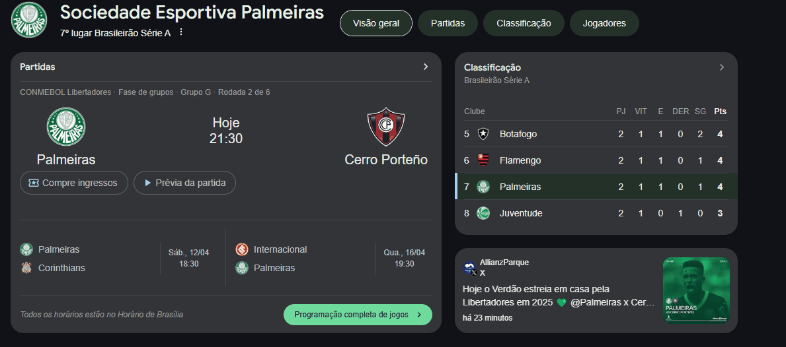

# Projeto com README
Um projeto de teste com um arquivo README 😁

[](https://www.google.com/search?gs_ssp=eJzj4tTP1TcwtMwpTzJg9OIsSMzJTc0sSiwGAEkEBwA&q=palmeiras&oq=&gs_lcrp=EgZjaHJvbWUqCQgAEC4YJxjqAjIJCAAQLhgnGOoCMgkIARAjGCcY6gIyCQgCECMYJxjqAjIJCAMQIxgnGOoCMgkIBBAjGCcY6gIyCQgFECMYJxjqAjIJCAYQIxgnGOoCMgkIBxAjGCcY6gLSAQ01MjQ3ODA4NjhqMGo3qAIIsAIB8QXi8h05T4cH1A&sourceid=chrome&ie=UTF-8)

## Tecnologias utilizadas
- HTML
- CSS
- JS

### Como utilizar

Clone para o projetor
```
git clone
```
Acesse a pasta do projetor
```
cd repositorio-com-readme
```
Todas as informações nessa página é puramente para teste e aprendizado.